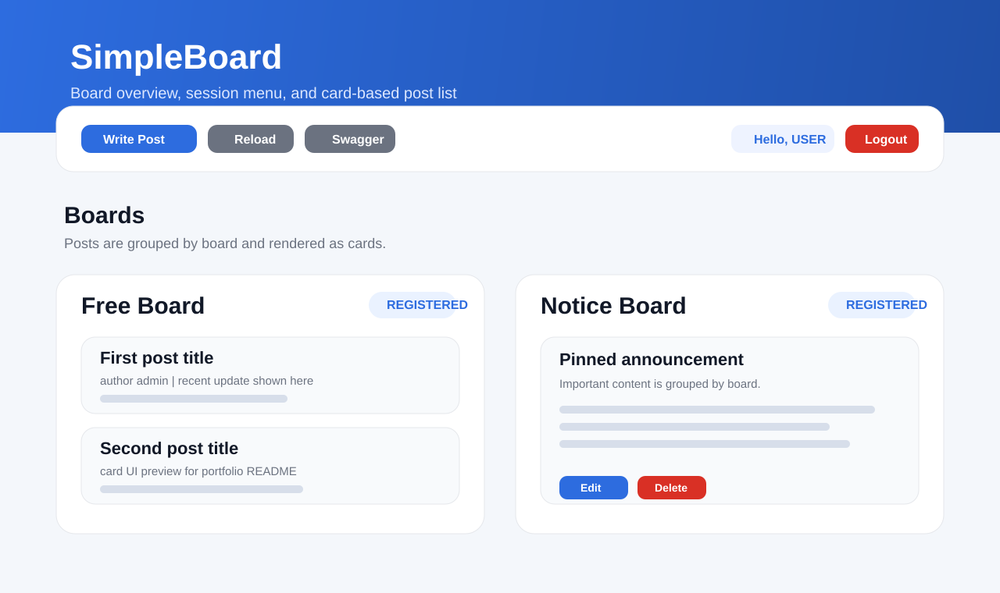
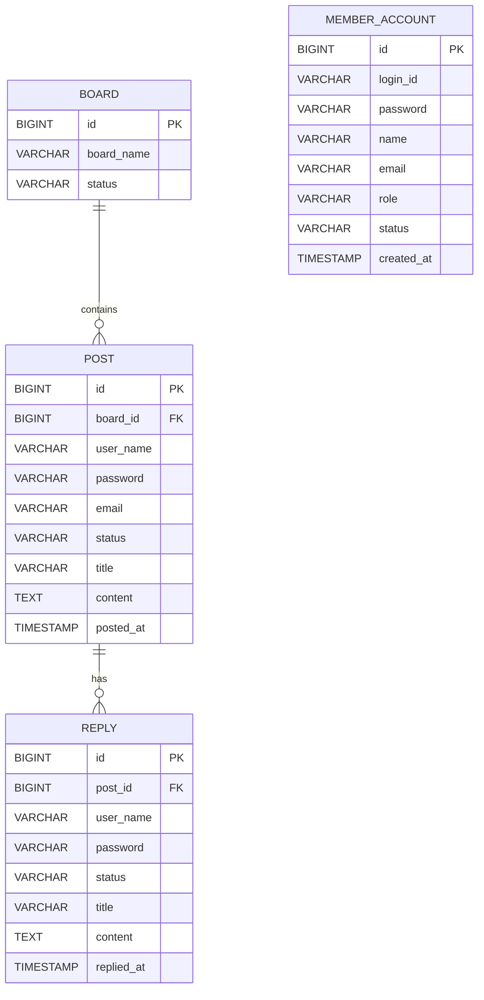
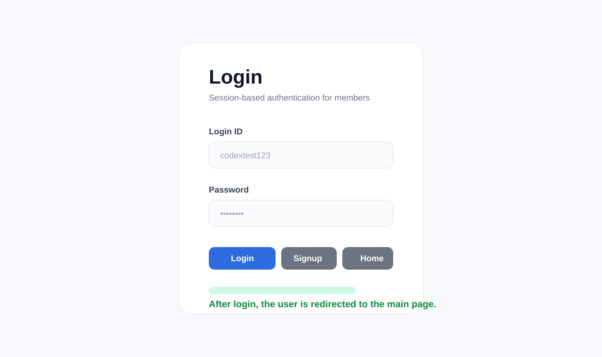
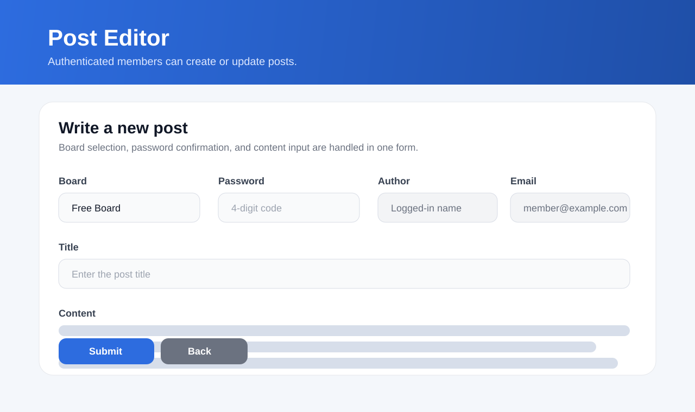
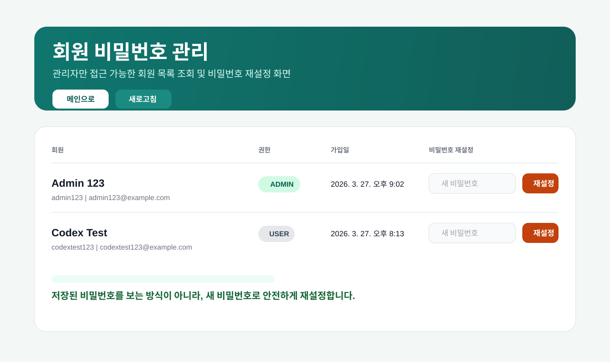

# SimpleBoard


세션 기반 인증, 게시글 관리, 관리자 권한 분기를 중심으로 설계한 Spring Boot 게시판 프로젝트입니다.  
단순 CRUD 구현을 넘어서 인증 흐름, 권한 제어, 비밀번호 보안 정책, 운영 환경 시간대 이슈, 관리자 재설정 기능까지 반영해 실제 서비스 운영 관점의 문제를 함께 다뤘습니다.



## 프로젝트 한눈에 보기

- 유형: 개인 백엔드 포트폴리오 프로젝트
- 목표: Spring Boot 기반 웹 애플리케이션의 핵심 흐름을 설계부터 배포까지 직접 구현
- 구현 범위: 회원가입, 로그인, 세션 인증, 게시글 작성/수정/삭제, 관리자 회원 관리, 관리자 비밀번호 재설정
- 배포 환경: Render
- 데이터베이스: Supabase PostgreSQL
- 문서화: Swagger UI

## 링크

- 서비스: https://simpleboard-k994.onrender.com
- Swagger UI: https://simpleboard-k994.onrender.com/swagger-ui.html
- GitHub Repository: https://github.com/uijin7/SimpleBoard

## 문제 정의

게시판은 익숙한 도메인이지만 실제 구현 단계에서는 다음과 같은 고민이 필요하다고 생각했습니다.

- 로그인 상태를 어떤 방식으로 유지할 것인가
- 일반 사용자와 관리자 권한을 어떻게 나눌 것인가
- 비밀번호를 안전하게 저장하면서도 운영상 필요한 관리자 기능은 어떻게 제공할 것인가
- 로컬과 배포 환경의 시간대 차이로 발생하는 데이터 오차를 어떻게 해결할 것인가

이 프로젝트는 위 문제를 직접 설계하고 해결한 결과를 보여주기 위한 작업입니다.

## 핵심 기능

| 구분 | 내용 |
| --- | --- |
| 인증 | 회원가입, 로그인, 로그아웃, 현재 로그인 사용자 조회 |
| 세션 관리 | `HttpSession` 기반 로그인 상태 유지 |
| 접근 제어 | 인터셉터로 작성/수정/삭제 및 관리자 경로 보호 |
| 게시글 | 게시판별 목록 조회, 게시글 작성/수정/삭제 |
| 관리자 | 회원 목록 조회, 회원 비밀번호 재설정 |
| 관리자 예외 처리 | 관리자는 게시글 비밀번호 없이 수정/삭제 가능 |
| 운영 대응 | 한국 시간대 기준 저장, 기존 데이터 시간 보정 |
| API 문서 | Swagger UI 제공 |

## 기술 선택과 이유

### Spring Boot + JPA

- 게시판, 회원, 권한 같은 도메인 모델을 빠르게 구성할 수 있고
- `controller / service / repository / entity / model` 구조로 역할이 분리된 코드를 만들기 적절하다고 판단했습니다.

### Thymeleaf + Fetch API

- 서버 렌더링 기반 페이지를 유지하면서도
- 로그인 상태 조회, 게시글 삭제, 관리자 비밀번호 재설정 같은 동작만 비동기로 처리해 과하지 않은 프론트 구조를 구성했습니다.

### BCrypt 비밀번호 저장

- 저장된 비밀번호에서 원문을 복원할 수 없도록 해시 기반 저장을 유지했습니다.
- 관리자 기능도 “원래 비밀번호 조회”가 아니라 “새 비밀번호 재설정”으로 설계했습니다.

### Supabase PostgreSQL + Render

- 포트폴리오 프로젝트를 실제 배포 환경까지 연결하기 적절했고
- 로컬과 운영 환경 차이, DB 연결, 설정 파일 관리까지 함께 경험할 수 있었습니다.

## 시스템 아키텍처

```mermaid
flowchart LR
    A[Browser / Thymeleaf Page] --> B[Spring MVC Controller]
    B --> C[Service Layer]
    C --> D[Spring Data JPA Repository]
    D --> E[(Supabase PostgreSQL)]

    A --> F[/api/auth/me]
    A --> G[/api/post]
    A --> H[/api/admin/members]

    F --> B
    G --> B
    H --> B
```

## ERD



참고:

- `member_account`는 로그인과 권한 관리를 담당합니다.
- 현재 게시글과 댓글은 회원 엔티티와 FK로 직접 연결하지 않고, 작성 시점의 표시값을 별도로 저장하는 구조입니다.

## 권한 매트릭스

| 기능 | 비로그인 사용자 | 일반 회원 | 관리자 |
| --- | --- | --- | --- |
| 메인 화면 조회 | 가능 | 가능 | 가능 |
| 회원가입 / 로그인 | 가능 | 불필요 | 불필요 |
| 게시글 작성 | 불가 | 가능 | 가능 |
| 게시글 수정 | 불가 | 가능, 게시글 비밀번호 필요 | 가능, 게시글 비밀번호 불필요 |
| 게시글 삭제 | 불가 | 가능, 게시글 비밀번호 필요 | 가능, 게시글 비밀번호 불필요 |
| 회원 목록 조회 | 불가 | 불가 | 가능 |
| 회원 비밀번호 재설정 | 불가 | 불가 | 가능 |

## 대표 API 요약

| Method | Endpoint | 인증 | 설명 |
| --- | --- | --- | --- |
| `POST` | `/api/auth/signup` | 없음 | 회원가입 |
| `POST` | `/api/auth/login` | 없음 | 로그인 |
| `POST` | `/api/auth/logout` | 로그인 | 로그아웃 |
| `GET` | `/api/auth/me` | 선택 | 현재 로그인 사용자 확인 |
| `GET` | `/api/board/ids` | 없음 | 게시판 + 게시글 목록 조회 |
| `POST` | `/api/post` | 로그인 | 게시글 작성 |
| `GET` | `/api/post/all` | 없음 | 게시글 목록 조회 |
| `POST` | `/api/post/update` | 로그인 | 게시글 수정 |
| `POST` | `/api/post/delete` | 로그인 | 게시글 삭제 |
| `GET` | `/api/admin/members` | 관리자 | 회원 목록 조회 |
| `POST` | `/api/admin/members/{memberId}/password` | 관리자 | 회원 비밀번호 재설정 |

## 핵심 구현 포인트

### 1. 세션 기반 인증 흐름

- 로그인 성공 시 `LOGIN_MEMBER`를 세션에 저장
- `/api/auth/me`를 통해 프론트에서 현재 로그인 사용자와 권한을 확인
- `LoginCheckInterceptor`로 보호 경로를 분리해 비로그인 접근을 차단

### 2. 관리자 권한 분기

- 일반 사용자와 관리자 권한을 세션 기반으로 구분
- 관리자만 `/admin/**`, `/api/admin/**` 경로 접근 가능
- 관리자 화면에서 회원 목록 조회와 비밀번호 재설정 수행
- 게시글 수정/삭제 시 관리자 권한이면 게시글 비밀번호 검증을 우회

### 3. 비밀번호 보안 정책

- 회원 비밀번호는 `BCryptPasswordEncoder`로 해시 저장
- 저장된 값으로 원문 비밀번호를 복원하는 기능은 제공하지 않음
- 운영상 필요한 관리자 기능은 “비밀번호 조회”가 아니라 “재설정” 방식으로 설계

### 4. 시간대 이슈 해결

- 배포 환경 시간대와 로컬 환경 시간 차이로 게시글 시간이 어긋나는 문제를 확인
- 공통 시간 생성 로직과 애플리케이션 시간대 설정을 `Asia/Seoul` 기준으로 통일
- 기존 Supabase 데이터는 별도 SQL 스크립트로 일괄 보정

## 트러블슈팅

### 1. 배포 환경에서 게시글 시간이 9시간 어긋나는 문제

- 원인: 서버 기본 시간대와 `LocalDateTime.now()` 저장 시점이 운영 환경과 일치하지 않았습니다.
- 해결: 한국 시간대 기준 공통 시간 생성 로직을 도입하고, Jackson / Hibernate / 애플리케이션 기본 시간대를 함께 맞췄습니다.
- 추가 대응: 기존 운영 데이터는 `scripts/fix-kst-timestamps.sql`로 일괄 보정했습니다.

### 2. 관리자 입장에서 회원 비밀번호를 “볼 수 있어야 한다”는 요구

- 문제: BCrypt는 복호화가 불가능해 저장값으로 원래 비밀번호를 확인할 수 없습니다.
- 판단: 원문 조회 기능은 보안상 위험하므로 제공하지 않기로 했습니다.
- 해결: 관리자 비밀번호 재설정 API를 추가해 운영 기능은 유지하면서도 보안 원칙을 지켰습니다.

### 3. 관리자 권한과 일반 사용자 게시글 수정/삭제 흐름이 다른 문제

- 문제: 일반 사용자는 게시글 비밀번호가 필요하지만, 관리자까지 같은 제약을 적용하면 운영 효율이 떨어집니다.
- 해결: 세션 권한을 기준으로 분기해 관리자는 게시글 비밀번호 없이 수정/삭제할 수 있도록 처리했습니다.

## 시연 포인트

기업 제출용 README에서 빠르게 보여주고 싶은 흐름은 아래와 같습니다.

1. 로그인 후 메인 화면에서 세션 상태와 권한별 메뉴가 달라지는 점
2. 게시글 작성/수정/삭제가 로그인 사용자 기준으로 보호되는 점
3. 관리자 화면에서 회원 목록 조회 및 비밀번호 재설정이 가능한 점
4. 관리자는 게시글 비밀번호 없이 수정/삭제할 수 있도록 별도 권한 분기가 적용된 점
5. 시간대 보정으로 운영 데이터 오류를 해결한 점

## 화면 예시

README에 사용한 이미지는 실제 UI 흐름을 설명하기 위해 정리한 화면 예시입니다.

### 로그인 화면



### 게시글 작성/수정 화면



### 관리자 회원 관리 화면



## 프로젝트 구조

```text
src/main/java/com/example/simpleboard
- board/
- member/
- post/
- reply/
- global/
- web/
- config/
```

### 패키지 구성 의도

- `board`, `member`, `post`, `reply`: 도메인 중심 패키지
- `controller`: HTTP 요청/응답 처리
- `service`: 비즈니스 로직
- `repository`: DB 접근
- `entity`: JPA 엔티티
- `model`: 요청/응답 DTO
- `web`: 페이지 라우팅 및 인터셉터
- `config`: 설정 클래스

## 실행 방법

### 1. 설정 파일 준비

루트 경로에 `application-secret.yaml` 파일을 생성하고 DB 접속 정보를 입력합니다.

```powershell
Copy-Item .\application-secret.yaml.example .\application-secret.yaml
```

예시:

```yaml
spring:
  datasource:
    driver-class-name: org.postgresql.Driver
    url: jdbc:postgresql://db.<project-ref>.supabase.co:5432/postgres?sslmode=require
    username: postgres
    password: <your-supabase-password>

  jpa:
    database-platform: org.hibernate.dialect.PostgreSQLDialect

server:
  port: 8082
```

### 2. 애플리케이션 실행

Windows:

```powershell
.\gradlew.bat bootRun
```

또는

```powershell
.\scripts\run-local.ps1
```

macOS / Linux:

```bash
./gradlew bootRun
```

### 3. 접속 확인

- Home: `http://localhost:8082/`
- Swagger UI: `http://localhost:8082/swagger-ui.html`

## 검증 방법

### 정적 검증

```powershell
.\gradlew.bat build
```

### 수동 시나리오 검증

1. 회원가입 후 로그인
2. 로그인 상태에서 게시글 작성
3. 일반 회원으로 게시글 수정/삭제 시 비밀번호 검증 확인
4. 관리자 계정으로 로그인 후 회원관리 페이지 접근
5. 관리자 비밀번호 재설정 API 동작 확인
6. 관리자 권한으로 게시글 비밀번호 없이 수정/삭제 확인

## 리뷰 안내

- 공개 README에는 관리자 계정 정보를 직접 노출하지 않았습니다.
- 포트폴리오 제출 또는 리뷰 상황에서는 시연용 계정을 별도로 전달하는 방식이 더 안전하다고 판단했습니다.
- 관리자 기능 시연 시에는 회원 관리, 비밀번호 재설정, 게시글 관리 권한 흐름을 확인할 수 있습니다.
- 댓글 도메인과 API 구조는 포함되어 있지만, 현재 README 시연 흐름은 게시글/인증/관리자 시나리오 중심으로 정리했습니다.

## 문서 및 보조 스크립트

- `docs/project-structure.md`
- `scripts/fix-kst-timestamps.sql`
- `scripts/run-local.ps1`
- `application-secret.yaml.example`

## 회고

이 프로젝트는 “게시판을 만들 수 있는가”보다 “운영과 보안을 고려해 어디까지 설계할 수 있는가”를 보여주기 위한 작업이었습니다.

특히 아래 두 가지를 핵심 개선 포인트로 정리했습니다.

- 비밀번호를 보여주는 관리자 기능이 아니라, 보안을 해치지 않는 재설정 기능으로 방향을 잡은 점
- 배포 환경 시간대 차이로 발생한 데이터 문제를 코드와 기존 데이터 양쪽에서 함께 정리한 점

다음 단계에서는 아래 항목을 확장할 수 있습니다.

- 테스트 코드 보강
- 예외 응답 포맷 통일
- 관리자 감사 로그
- 댓글 기능 UI 확장
