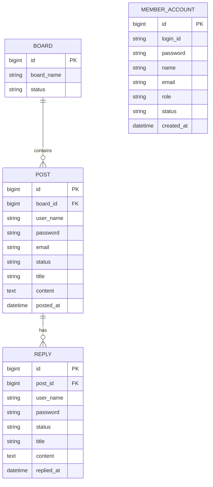
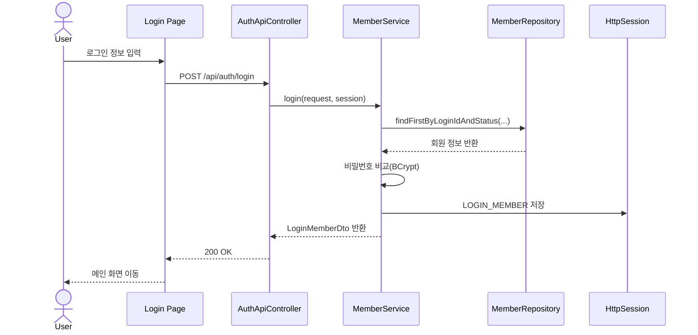
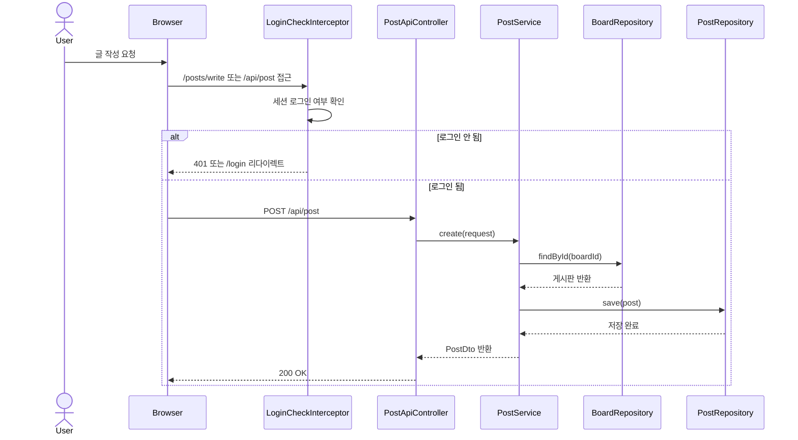

# SimpleBoard

Spring Boot 기반 게시판 프로젝트입니다.  
게시판, 게시글, 댓글, 회원 인증 기능을 구현했고, 단순 CRUD 구현을 넘어서 `도메인 분리`, `세션 기반 인증`, `공통 CRUD 추상화`, `배포 자동화`까지 연결해보는 것을 목표로 만들었습니다.

이 README는 포트폴리오 제출용 문서 기준으로 정리했습니다.  
기능 목록만 나열하기보다, 어떤 구조로 설계했고 어떤 문제를 해결했는지가 바로 보이도록 구성했습니다.

## 프로젝트 한눈에 보기

- 프로젝트명: `SimpleBoard`
- 형태: 개인 프로젝트
- 성격: 백엔드 중심 웹 프로젝트
- 배포 환경: `Render`
- 운영 DB: `Supabase PostgreSQL`
- 로컬 개발 DB: `H2`
- 문서화: `Swagger UI`

## Links

- 서비스: https://simpleboard-k994.onrender.com
- Swagger UI: https://simpleboard-k994.onrender.com/swagger-ui.html
- GitHub Repository: https://github.com/uijin7/SimpleBoard

## 프로젝트 소개

게시판 서비스는 겉으로 보기에는 단순하지만, 실제로는 백엔드 개발에서 자주 마주치는 핵심 요소가 모두 들어갑니다.

- 인증과 세션 관리
- 게시판, 게시글, 댓글 간 연관관계 설계
- Validation과 예외 처리
- 화면 접근 제어
- 로컬과 운영 환경 분리
- 배포 가능한 구조로의 정리

SimpleBoard는 이런 요소를 한 프로젝트 안에서 직접 설계하고 연결해보는 데 초점을 둔 프로젝트입니다.  
특히 "기능이 동작한다"에서 끝나지 않고, 구조를 어떻게 나누고 책임을 어떻게 분리할지까지 고민한 흔적을 담았습니다.

## 핵심 기능

### 1. 회원 인증

- 회원가입, 로그인, 로그아웃, 현재 로그인 사용자 조회 API 구현
- `BCryptPasswordEncoder`를 사용한 비밀번호 암호화 저장
- 세션 기반 로그인 상태 유지
- 로그인하지 않은 사용자는 글 작성/수정 관련 경로 접근 제한

### 2. 게시판 / 게시글 / 댓글

- 게시판 생성 및 조회
- 게시글 작성, 상세 조회, 수정, 삭제, 목록 조회
- 댓글 생성, 조회, 수정, 삭제, 목록 조회
- 게시글 목록 페이징 처리
- 게시글 수정/삭제 시 비밀번호 확인 로직 적용

### 3. 웹 화면 제공

- `Thymeleaf` 기반 화면 제공
- 홈, 로그인, 회원가입, 글 작성, 글 수정 페이지 구성
- API만 제공하는 프로젝트가 아니라 실제 사용자 흐름까지 확인 가능

### 4. 문서화와 예외 처리

- `springdoc-openapi` 기반 Swagger UI 제공
- Validation 에러와 비즈니스 예외를 공통 응답 형식으로 처리

## 기술 스택

### Backend

- Java 17
- Spring Boot 2.7.18
- Spring Web
- Spring Data JPA
- Spring Validation
- Thymeleaf
- Spring Security Crypto
- Springdoc OpenAPI UI

### Database

- H2
- Supabase PostgreSQL

### Infra / DevOps

- Render
- Docker
- GitHub Actions
- Gradle

## 설계 포인트

### 도메인 중심 패키지 구조

`board`, `post`, `reply`, `member` 단위로 패키지를 분리했습니다.  
각 도메인 안에서 `controller`, `service`, `repository`, `entity`, `model`을 구분해 책임이 자연스럽게 드러나도록 구성했습니다.

이 구조를 선택한 이유는 아래와 같습니다.

- 기능별 책임을 빠르게 파악할 수 있음
- 수정 범위를 도메인 단위로 좁히기 쉬움
- 프로젝트가 커져도 구조가 덜 흐트러짐

### 공통 CRUD 추상화

댓글 영역에는 공통 CRUD 추상화 구조를 적용했습니다.

- `CrudApiController`
- `CrudService`
- `CrudConverter`

반복되는 CRUD 로직을 공통화해 구조적 일관성을 유지하려고 했고, 단순 구현을 넘어서 중복을 어떻게 줄일지까지 고민했습니다.

### 세션 기반 인증과 인터셉터

`LoginCheckInterceptor`를 사용해 보호가 필요한 경로를 제어했습니다.

- `/posts/write`
- `/posts/edit/**`
- `/api/post`
- `/api/post/update`
- `/api/post/delete`

API 요청은 `401 Unauthorized`, 페이지 요청은 `/login` 리다이렉트로 분기해 사용자 경험과 API 응답 성격을 구분했습니다.

### 로컬 / 운영 환경 분리

로컬에서는 외부 DB 없이 바로 실행할 수 있도록 `H2`를 기본값으로 두고,  
배포 환경에서는 환경 변수를 통해 `Supabase PostgreSQL`에 연결하도록 구성했습니다.

이 과정을 통해 "내 PC에서만 실행되는 프로젝트"가 아니라 실제 서비스 배포가 가능한 구조로 정리했습니다.

## 포트폴리오에서 강조하고 싶은 경험

- JPA 연관관계를 활용한 게시판, 게시글, 댓글 도메인 설계
- DTO와 Entity 분리
- Validation 기반 입력값 검증
- 세션 로그인과 인터셉터를 이용한 접근 제어
- 공통 CRUD 추상화 적용 경험
- Swagger 기반 API 문서화
- GitHub Actions와 Render를 이용한 배포 자동화 흐름 구성
- 운영 DB를 Supabase PostgreSQL로 연결한 경험

## 주요 화면

포트폴리오 문서에서 빠르게 이해할 수 있도록 대표 화면 시각자료를 함께 정리했습니다.

| 화면 | 경로 | 설명 |
| --- | --- | --- |
| 메인 화면 | `/` | 게시판과 게시글 목록을 카드 형태로 조회하고, 로그인 상태에 따라 메뉴를 다르게 표시 |
| 로그인 | `/login` | 세션 기반 로그인 처리 |
| 회원가입 | `/signup` | 사용자 등록 후 로그인 화면으로 이동 |
| 글 작성 | `/posts/write` | 로그인 사용자 정보를 기반으로 게시글 작성 |
| 글 수정 | `/posts/edit/{id}` | 기존 게시글 정보를 불러와 수정 |

### 메인 화면 예시


### 로그인 화면 예시


### 게시글 작성 화면 예시


## ERD



`member_account`는 로그인 사용자 정보를 관리하고,  
`post`와 `reply`는 작성 시점의 작성자 이름과 이메일을 별도 필드로 저장하는 구조입니다.

## 시퀀스 다이어그램

### 로그인 흐름



### 게시글 작성 흐름



## 트러블슈팅

### 1. 로컬 DB와 운영 DB 차이로 인한 설정 분리 필요

초기에는 로컬 개발과 배포 환경을 같은 방식으로 생각하기 쉬웠지만, 실제로는 로컬은 빠르게 실행 가능한 환경이 필요했고 운영은 외부 DB 연결이 필요했습니다.

- 로컬 기본 DB는 `H2`
- 운영 DB는 `Supabase PostgreSQL`
- 환경 변수로 `DB_URL`, `DB_USERNAME`, `DB_PASSWORD`, `JPA_DIALECT` 주입

이 과정을 통해 설정을 코드에 고정하지 않고 환경에 따라 분리하는 방식의 중요성을 체감했습니다.

### 2. 로그인 필요 경로에서 API와 페이지 응답을 다르게 처리해야 했음

인증이 필요한 경로를 막을 때, 브라우저 페이지 요청과 API 요청을 같은 방식으로 처리하면 사용자 경험이 어색해질 수 있었습니다.

- 페이지 요청은 `/login`으로 리다이렉트
- API 요청은 `401 Unauthorized` 반환

이를 `LoginCheckInterceptor`에서 분기 처리해 화면 흐름과 API 응답을 각각 자연스럽게 유지했습니다.

### 3. 반복 CRUD 구조를 공통화할 필요가 있었음

댓글 영역을 구현하면서 CRUD 패턴이 반복된다는 점을 확인했고, 이를 공통 추상화 구조로 정리했습니다.

- `CrudApiController`
- `CrudService`
- `CrudConverter`

프로젝트 규모는 크지 않지만, 이런 시도를 통해 단순 기능 구현을 넘어 구조적 일관성을 유지하는 방식까지 경험할 수 있었습니다.

### 4. Builder 사용 시 컬렉션 기본값 유지 문제

엔티티에서 컬렉션 필드를 `Builder`로 생성할 때 기본값이 사라질 수 있어 `@Builder.Default`를 적용했습니다.

- `BoardEntity.postList`
- `PostEntity.replyList`

이를 통해 `null` 가능성을 줄이고 객체 생성 안정성을 높였습니다.

## 패키지 구조

```text
src/main/java/com/example/simpleboard
- board/
  - controller/
  - entity/
  - model/
  - repository/
  - service/
- member/
  - controller/
  - entity/
  - model/
  - repository/
  - service/
- post/
  - controller/
  - entity/
  - model/
  - repository/
  - service/
- reply/
  - controller/
  - entity/
  - model/
  - repository/
  - service/
- global/
  - api/
  - crud/
  - error/
  - pagination/
- web/
  - controller/
  - interceptor/
- config/
- SimpleBoardApplication.java
```

## 실행 및 확인

### 로컬 실행

Windows

```powershell
.\gradlew.bat bootRun
```

macOS / Linux

```bash
./gradlew bootRun
```

기본 포트는 `8082`입니다.

- 홈: `http://localhost:8082/`
- Swagger UI: `http://localhost:8082/swagger-ui.html`
- H2 Console: `http://localhost:8082/h2-console`

### 주요 환경 변수

```yaml
SERVER_PORT=8082
DB_DRIVER=org.postgresql.Driver
DB_URL=jdbc:postgresql://<host>:5432/<database>
DB_USERNAME=<username>
DB_PASSWORD=<password>
JPA_DIALECT=org.hibernate.dialect.PostgreSQLDialect
DDL_AUTO=update
UPLOAD_PATH=./upload
```

## 배포 흐름

현재 배포는 아래 흐름으로 구성했습니다.

1. GitHub `main` 브랜치에 코드 반영
2. GitHub Actions에서 `./gradlew clean build` 실행
3. Render Deploy Hook 호출
4. Render가 Docker 기반으로 애플리케이션 재배포
5. 애플리케이션이 Supabase PostgreSQL에 연결

## 개선 방향

- 테스트 코드 보강
- 예외 메시지와 응답 구조 고도화
- 인증/인가 구조 확장
- 게시글/댓글 권한 모델 정교화
- README의 대표 화면 시각자료를 실제 서비스 캡처 이미지로 교체

## 정리

SimpleBoard는 게시판 CRUD를 구현하는 데서 끝나는 프로젝트가 아니라,  
백엔드 서비스에서 자주 만나게 되는 인증, 도메인 설계, 예외 처리, 환경 분리, 배포까지 한 흐름으로 다뤄본 프로젝트입니다.

포트폴리오 관점에서는 아래 역량을 보여주는 데 의미가 있습니다.

- Spring Boot 기반 웹 애플리케이션 구현
- JPA 기반 도메인 모델링
- 세션 인증과 인터셉터 활용
- 공통화와 구조화를 고려한 코드 설계
- 실제 배포 가능한 환경 구성 경험
