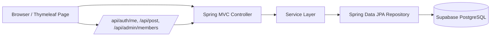

# SimpleBoard


세션 기반 인증, 게시글 관리, 관리자 권한 기능을 중심으로 설계한 Spring Boot 게시판 프로젝트입니다.  
단순 CRUD 구현에 그치지 않고, 권한 분기, 비밀번호 보안 정책, 운영 환경 시간대 이슈, 관리자 재설정 기능까지 포함해 실제 서비스 운영 관점의 문제를 함께 다뤘습니다.


## 프로젝트 한눈에 보기

- 유형: 개인 포트폴리오 프로젝트
- 목적: Spring Boot 기반 웹 애플리케이션의 핵심 흐름을 백엔드 중심으로 구현하고 실제 배포까지 연결
- 구현 범위: 회원가입, 로그인, 세션 인증, 게시글 작성/수정/삭제, 관리자 회원 관리, 관리자 비밀번호 재설정
- 배포 환경: Render
- 데이터베이스: Supabase PostgreSQL
- 문서화: Swagger UI

## 링크

- 서비스: https://simpleboard-k994.onrender.com
- Swagger UI: https://simpleboard-k994.onrender.com/swagger-ui.html
- GitHub Repository: https://github.com/uijin7/SimpleBoard

## 왜 이 프로젝트를 만들었는가

게시판은 익숙한 도메인이지만, 실제 구현에서는 다음과 같은 고민이 필요합니다.

- 로그인 상태를 어떤 방식으로 유지할 것인가
- 일반 사용자와 관리자의 권한을 어떻게 분리할 것인가
- 비밀번호를 안전하게 저장하면서도 운영상 필요한 관리자 기능은 어떻게 제공할 것인가
- 로컬과 배포 환경의 시간대 차이로 발생하는 데이터 오차를 어떻게 해결할 것인가

이 프로젝트는 위 문제를 직접 설계하고 해결한 결과를 보여주기 위한 작업입니다.

## 핵심 기능

| 구분 | 내용 |
| --- | --- |
| 인증 | 회원가입, 로그인, 로그아웃, 현재 로그인 사용자 조회 |
| 세션 관리 | `HttpSession` 기반 로그인 상태 유지 |
| 접근 제어 | 인터셉터로 작성/수정/삭제 및 관리자 경로 보호 |
| 게시글 | 게시판별 목록 조회, 게시글 작성/수정/삭제 |
| 관리자 | 회원 목록 조회, 회원 비밀번호 재설정 |
| 관리자 예외 처리 | 관리자는 게시글 비밀번호 없이 수정/삭제 가능 |
| 운영 대응 | 한국 시간대 기준 저장, 기존 데이터 시간 보정 |
| API 문서 | Swagger UI 제공 |

## 기술 선택과 이유

### Spring Boot + JPA

- 게시판, 회원, 권한 같은 도메인 모델을 빠르게 구성할 수 있고
- 서비스 계층과 엔티티, DTO를 분리해 역할이 드러나는 구조를 만들기 좋다고 판단했습니다.

### Thymeleaf + Fetch API

- 서버 렌더링 기반 페이지를 유지하면서도
- 로그인 상태 조회, 게시글 삭제, 관리자 비밀번호 재설정처럼 필요한 부분만 비동기로 처리할 수 있어 과하지 않은 프론트 구조를 만들 수 있었습니다.

### BCrypt 비밀번호 저장

- 저장된 비밀번호에서 원문을 복원할 수 없도록 해시 기반 저장을 유지했습니다.
- 관리자 기능도 “원래 비밀번호 조회”가 아니라 “새 비밀번호 재설정”으로 설계했습니다.

### Supabase PostgreSQL + Render

- 포트폴리오 프로젝트를 실제 배포 환경까지 연결하기에 적절했고
- 로컬 환경과 배포 환경 차이, DB 연결, 설정 파일 관리까지 경험할 수 있었습니다.

## 아키텍처



## 핵심 구현 포인트

### 1. 세션 기반 인증 흐름

- 로그인 성공 시 `LOGIN_MEMBER`를 세션에 저장
- `/api/auth/me`를 통해 현재 로그인 사용자와 권한을 프론트에서 확인
- `LoginCheckInterceptor`로 보호 경로를 분리해 비로그인 접근 차단

### 2. 관리자 권한 분기

- 일반 사용자와 관리자 권한을 세션 기반으로 분리
- 관리자만 `/admin/**`, `/api/admin/**` 경로 접근 가능
- 관리자 페이지에서 회원 목록 조회와 비밀번호 재설정 수행
- 게시글 수정/삭제 시 관리자면 게시글 비밀번호 검증을 우회

### 3. 비밀번호 보안 정책

- 회원 비밀번호는 `BCryptPasswordEncoder`로 해시 저장
- 원문 비밀번호 조회 기능은 제공하지 않음
- 운영상 필요한 관리자 기능은 “비밀번호 확인”이 아니라 “재설정”으로 제공

### 4. 시간대 이슈 해결

- 배포 환경 시간대와 로컬 환경 시간 차이로 게시글 시간이 어긋나는 문제 확인
- 공통 시간 생성 로직과 애플리케이션 시간대 설정을 `Asia/Seoul` 기준으로 통일
- 기존 Supabase 데이터는 별도 SQL 스크립트로 일괄 보정

## 시연 포인트

기업 제출용 README에서 빠르게 보여주고 싶은 흐름은 아래와 같습니다.

1. 로그인 후 메인 화면에서 세션 상태와 권한별 메뉴가 달라지는 점
2. 게시글 작성/수정/삭제가 로그인 사용자 기준으로 보호되는 점
3. 관리자 화면에서 회원 목록 조회 및 비밀번호 재설정이 가능한 점
4. 관리자는 게시글 비밀번호 없이 수정/삭제할 수 있도록 별도 권한 분기가 적용된 점
5. 시간대 보정으로 운영 데이터 오류를 해결한 점

## 화면 예시

README에 사용한 이미지는 실제 UI 흐름을 설명하기 위해 정리한 화면 예시입니다.

### 로그인 화면


### 게시글 작성/수정 화면


### 관리자 회원 관리 화면


## 프로젝트 구조

```text
src/main/java/com/example/simpleboard
- board/
- member/
- post/
- reply/
- global/
- web/
- config/
```

### 패키지 구성 의도

- `board`, `member`, `post`, `reply`: 도메인 중심 패키지
- `controller`: HTTP 요청/응답 처리
- `service`: 비즈니스 로직
- `repository`: DB 접근
- `entity`: JPA 엔티티
- `model`: 요청/응답 DTO
- `web`: 페이지 라우팅 및 인터셉터
- `config`: 설정 클래스

## 실행 방법

### 1. 설정 파일 준비

루트 경로에 `application-secret.yaml` 파일을 생성하고 DB 접속 정보를 입력합니다.

```powershell
Copy-Item .\application-secret.yaml.example .\application-secret.yaml
```

예시:

```yaml
spring:
  datasource:
    driver-class-name: org.postgresql.Driver
    url: jdbc:postgresql://db.<project-ref>.supabase.co:5432/postgres?sslmode=require
    username: postgres
    password: <your-supabase-password>

  jpa:
    database-platform: org.hibernate.dialect.PostgreSQLDialect

server:
  port: 8082
```

### 2. 애플리케이션 실행

Windows:

```powershell
.\gradlew.bat bootRun
```

또는

```powershell
.\scripts\run-local.ps1
```

macOS / Linux:

```bash
./gradlew bootRun
```

### 3. 접속 확인

- Home: `http://localhost:8082/`
- Swagger UI: `http://localhost:8082/swagger-ui.html`

## 리뷰 안내

- 공개 README에는 관리자 계정 정보를 직접 노출하지 않았습니다.
- 포트폴리오 제출 또는 리뷰 상황에서는 시연용 계정을 별도로 전달하는 방식이 더 안전하다고 판단했습니다.
- 관리자 기능 시연 시에는 회원 관리, 비밀번호 재설정, 게시글 관리 권한 흐름을 확인할 수 있습니다.

## 문서 및 보조 스크립트

- `docs/project-structure.md`
- `scripts/fix-kst-timestamps.sql`
- `scripts/run-local.ps1`
- `application-secret.yaml.example`

## 회고

이 프로젝트는 “게시판을 만들 수 있는가”보다 “운영과 보안을 고려해 어디까지 설계할 수 있는가”를 보여주기 위한 작업이었습니다.

특히 아래 두 가지를 핵심 개선 포인트로 정리했습니다.

- 비밀번호를 보여주는 관리자 기능이 아니라, 보안을 해치지 않는 재설정 기능으로 방향을 잡은 점
- 배포 환경 시간대 차이로 발생한 데이터 문제를 코드와 기존 데이터 양쪽에서 함께 정리한 점

다음 단계에서는 아래 항목을 확장할 수 있습니다.

- 테스트 코드 보강
- 예외 응답 포맷 통일
- 관리자 감사 로그
- 댓글 기능 UI 확장
